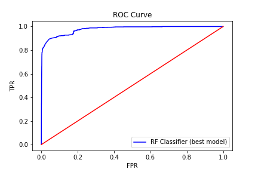

# Case Study Fraud Detection

### Authors: Karey, Megano, Nick, Aymeric

# Planned Scope
Challenge: The company needs to flag potential new fraud for further review
as it comes in so it can be triaged by most pressing (and costly) transactions.

Given a JSON file with transactions that are fraud and not and feature columns,
create a web based front-end to enable quick triage of potential new fraud.

Web app features:
Web app registers service at POST /register.
Web app accepts input records on POST /score endpoint.
Web app gives triage label: low, medium, high risk.

Planned work:
Day 1: EDA, plan approach, model.
Day 2: Database, AWS, web app, write up, presentation.

Process:
We are following the CRISP-DM workflow which is:
* Business understanding
* Data understanding
* Data preparation
* Modeling
* Evaluation
* Deployment
* Comparing models

# Business Understanding #
Business Background:
Fraud detection failures are not created equal.
False positives decrease customer/user trust.
False negatives cost money. Not all false negatives cost the same amount of $$$
Accessibility: Other (non-technical) people may need to interact w/ model/machinery
Manual review of borderline cases might be necessary.
The fraud problem is actually semi-supervised in a way.
We do not use the model to declare a ground truth about fraud or not fraud,
but simply to flag which transactions need further review.

# Data Understanding #
Load the data with pandas.
Add a 'Fraud' column that contains True or False values depending on whether
the event is fraudulent or not based on the acct_type field.
Check how many fraud and not fraud events we have.
Look at the features. Make note of ones we think will be particularly useful.
Do any data visualization that helps us understand the data.

# Data Preparation #
Scope the problem
Before modeling, plan approach.
Preprocessing we might want to do.
How will we build our feature matrix?
What different ideas do we have?
What models do we want to try?
What metric will we use to determine success?

# Modeling #
We created a simple model first, then used grid search to pick hyper parameters.

# Evaluation #
We will test each trained model using the "answer key" feature of fraud/not fraud.

# Deployment #
We plan to deploy the model via AWS and a web app front end.

# Comparing models #
We plan to use cross validation to compare models.

# Appendix #

## EXAMPLE USAGE
### From bash:

```bash
$ python predict.py example.json
```

This will give you a prediction of a json object respecting the following schema:
['fraud', 'eur', 'gbp', 'ach', 'check', 'missing_payment', 'dict_elements', 'gts',
'has_logo', 'user_type', 'delivery_method', 'org_facebook', 'org_twitter', 'has_analytics']

The data is 14,337 events from 2007-2013, of which 1,239 are fraudulent.  (We define events as fraudulent if the account type is labeled as fraudster, fraudulent_event, or fraudster_att.  We don’t classify spamming events as fraudulent.)

## Overall model scores:
F1 score: 0.87, Precision: 0.96, Recall: 0.79, Accuracy: 0.98
(0.86963906581740968,
 0.96421845574387943,
 0.79195668986852286,
 0.97858687312547954)

## ROC curve


# Data Sci Best Practices for our Team #
Code hygiene: Write clean and modular code with proper functions/encapsulation
Well documented: Include doc strings for every function/method)
Github: As we write code, always be committing (ABC)
Start simple: Get simplest model working first before trying complex ideas. Get a baseline built so that you can compare more complicated models to that one.
Feature engineering: Experiment with different featurization techniques like stemming, lemmatization, tf-idf, part of speech tagging, etc.
Try multiple models: Experiment with different models like SVM, Logistic Regression, Decision Trees, kNN, etc. We may end up with a final model that is a combination of multiple classification models.
Metrics: Compare their results. Make sure to do good comparison and don't just use accuracy!
Web app: Has well documented API
Extra: visualization of data/trend
